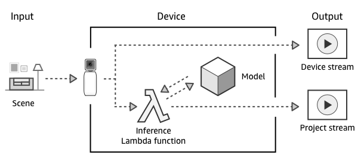

# Headtilt
## Introduction
AWS DeepLens is a AI enabled camera used for industrial ans well as domestic purposes. 

## DeepLens workflow

## Model

I have used a pre-built model for detecting 9 positions of headtilt.

## Lambda function

## 
